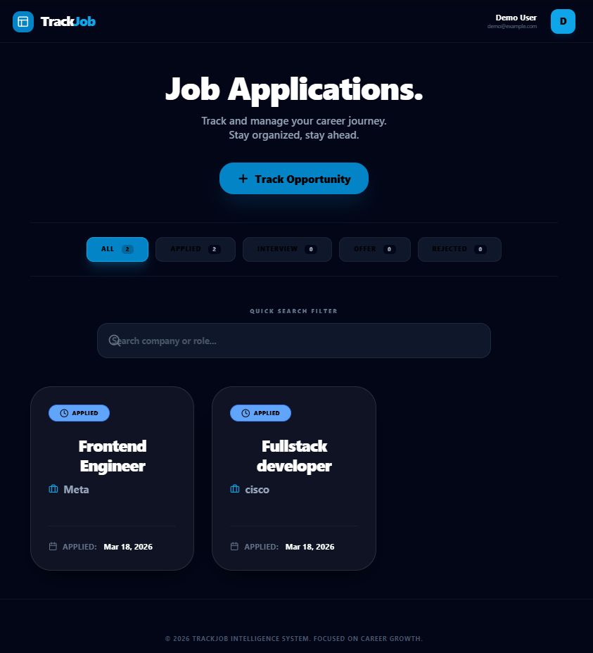
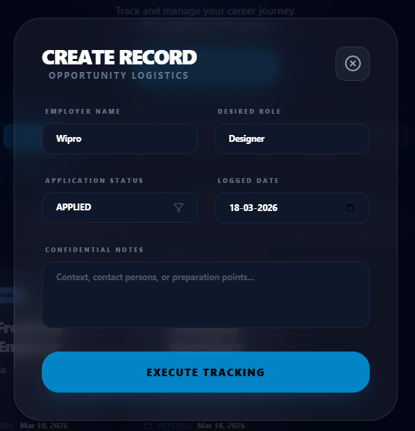

# 🚀 TrackJob: Premium Job Application Tracker

A high-performance, aesthetically stunning Job Application Tracker built with **Spring Boot 3 (Java 21)** and **React**. Designed for clarity, speed, and career growth.

---

## ✨ Features
- **Modern Dashboard**: High-contrast, premium dark mode UI with centered alignment for priority data.
- **Full CRUD**: Manage your application lifecycle (Applied, Interview, Offer, Rejected).
- **Fast Search**: Instant filtering by company or role.
- **Dockerized**: One-command setup for Backend, Frontend, and PostgreSQL.
- **Developer Focused**: Service-layer unit testing with >80% coverage and OpenAPI (Swagger) documentation.

---

## 📸 Screenshots

### 🖥️ Main Dashboard

*Modern centered layout with high-visibility filters.*

### 📝 Tracking Record

*Clear, large-scale input forms for seamless data entry.*

---

## 🛠️ Tech Stack

### Backend
- **Java 21** & **Spring Boot 3**
- **Spring Data JPA** (PostgreSQL)
- **Jakarta Validation** & **Swagger UI**
- **JUnit 5** & **Mockito**

### Frontend
- **React 18** (Vite)
- **Tailwind CSS** (via CDN Fallback for stability)
- **Lucide Icons** & **Glassmorphism Design**

---

## 🚀 Quick Start

### 1. Requirements
- Docker & Docker Compose installed.

### 2. Run the Application
From the root directory, execute:
```bash
docker-compose up --build
```
- **Frontend**: [http://localhost:5173](http://localhost:5173)
- **Backend API**: [http://localhost:8080](http://localhost:8080)
- **Swagger Docs**: [http://localhost:8080/swagger-ui.html](http://localhost:8080/swagger-ui.html)

### 3. Run Backend Tests
To verify the logic and coverage:
```bash
docker-compose run --rm backend mvn clean test
```

---

## 👤 Credits
Default Demo User: **John Doe** (`johndoe@gmail.com`)

---
*Built with focus on Carrer Intelligence.*